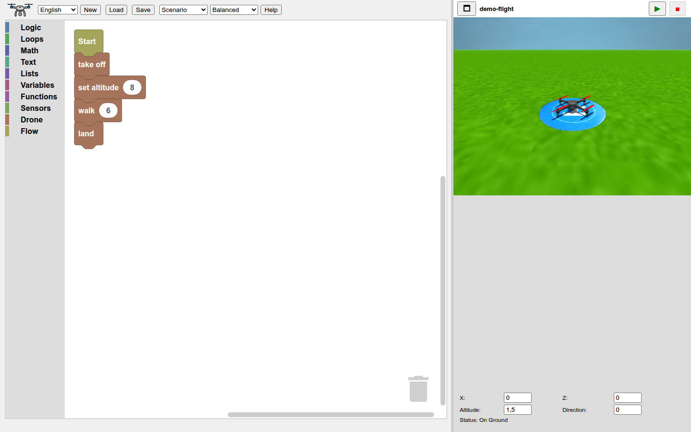
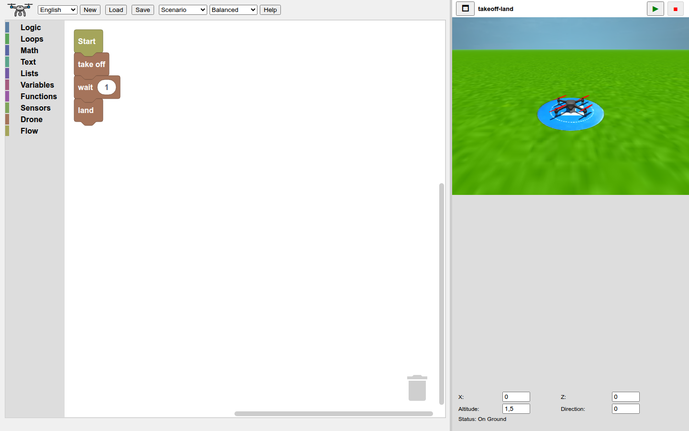
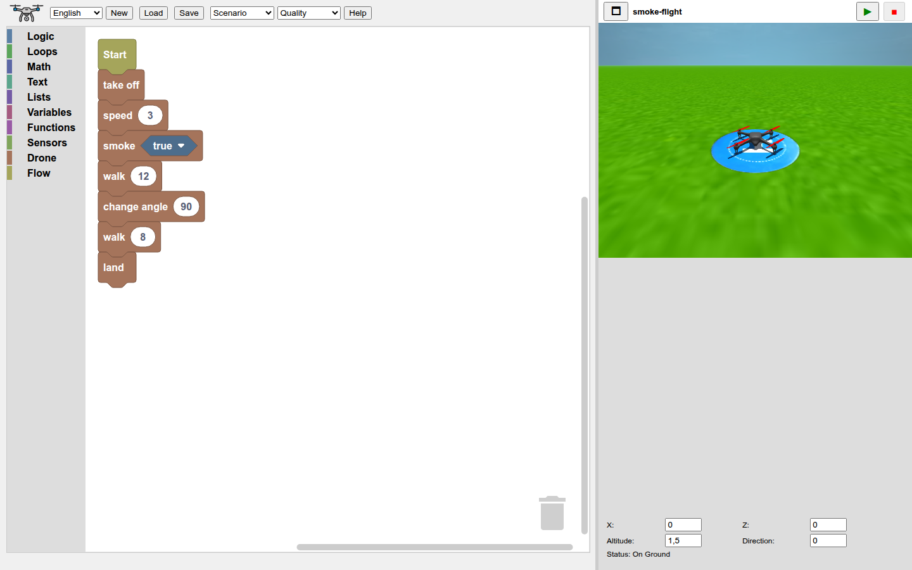

# Drone Commander



Drone Commander is an interactive browser app for programming and simulating drone flight with Blockly and Three.js. Build a flight plan with blocks, run it, and watch the drone move inside a 3D scene.

## Online Demo

Open the hosted version:

https://vroby65.github.io/DroneCommander/

## Features

- **Visual programming** with Blockly blocks for logic, loops, math, variables, functions, flow, sensors, and drone commands.
- **3D simulation** powered by Three.js, with terrain-aware altitude and landing behavior.
- **Drone commands** for take off, land, set/change altitude, set/change angle, walk, walk climbing, slide, absolute/relative 3D movement, smooth curved flight, return to base, wait, smoke trail, and speed control.
- **Smooth curve handling** with coordinate-based curved flight that leaves the drone direction unchanged.
- **Sensor blocks** for keyboard input, X/Z position, altitude, direction, and speed.
- **Scenarios**: flight field, urban track, metropolis, and tropical island.
- **Graphics profiles**: Performance, Balanced, and Quality.
- **Program management** with New, Save, Load, autosave to browser local storage, and remembered file names.
- **Multilingual UI and help** in English, Italian, French, German, Spanish, and Portuguese.
- **Resizable layout** with a Blockly editor, 3D viewer, and a status panel directly below the viewer with live program-variable values.

## Screenshots

### Take Off And Land



### Speed And Smoke Trail



## Run Locally

Clone the repository and serve it with any static HTTP server:

```sh
git clone https://github.com/vroby65/DroneCommander.git
cd DroneCommander
python3 -m http.server 8000
```

Then open:

```text
http://127.0.0.1:8000/
```

Using an HTTP server is recommended because the app loads scenarios, textures, models, sounds, and help pages from local files.

## Usage

1. Drag a **Start** block into the Blockly workspace.
2. Attach drone blocks such as **take off**, **set altitude**, **walk**, **walk climbing**, **go to**, **move by**, **curve abs**, **curve**, **return to base**, **change angle**, and **land**.
3. Click the green play button to run the program in the 3D viewer.
4. Use the panel directly below the 3D viewer to inspect or adjust X, Z, altitude, direction, and flight status. During execution it also lists every Blockly variable and its current value, one per line.
5. Use **Save** and **Load** to export or import Blockly XML programs.
6. Switch scenario or graphics profile from the toolbar when needed.

## Relative Movement Coordinates

The **move by** block interprets X/Y/Z relative to the drone's current direction. X moves right/left, Y moves up/down, and Z moves forward/backward. Changing the drone angle rotates the X/Z movement axes while leaving Y vertical.

## Curved Flight Notes

The **curve** and **curve abs** blocks fly through the current position, an intermediate point, and a destination point. Curves are interpolated as smooth arcs where possible and do not change the drone direction. The arc is calculated in the 3D plane defined by the three points, so circular paths can be horizontal, vertical, or tilted.

The drone banks while moving along a curve, so consecutive curve commands transition without separate pauses for tilting and straightening the drone.

For **curve abs**, both the intermediate point and destination use absolute program coordinates. For relative **curve** blocks, X/Y/Z is an offset from the current position, while XD/YD/ZD is an offset from that intermediate point. Both offsets rotate with the drone's current direction: Z is forward/backward and X is right/left.

## Project Structure

- `index.html` - Application shell, layout, and ordered script loading.
- `js/blockly.js` - Custom Blockly blocks, JavaScript generators, toolbox setup, and workspace persistence.
- `js/drone-commands.js` - Three.js simulation, command queue, flight commands, scenarios, collision handling, audio, and rendering.
- `js/ui.js` - Camera controls, status inputs, live program-variable monitoring, program actions, layout, localization, and selectors.
- `js/app.js` - Startup sequence that initializes localization, Blockly, Three.js, and the render loop.
- `doc/` - Help pages in supported languages.
- `backgrounds/` - Scenario definitions.
- `models/` - Drone and scene models.
- `textures/` - Terrain, sky, and object textures.
- `sounds/` - Drone audio assets.
- `libs/` - Vendored Blockly and Three.js libraries.
- `screenshots/` - README screenshots generated from the current app.

## License

This project is licensed under the MIT License. See [LICENSE](LICENSE) for details.

## Contributing

Contributions are welcome. Open an issue or pull request to suggest fixes, new blocks, new scenarios, translations, or documentation improvements.
