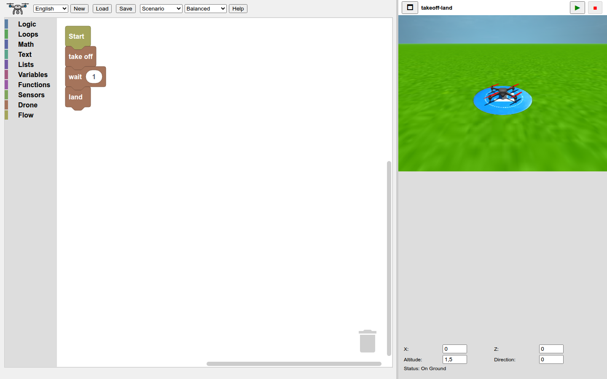
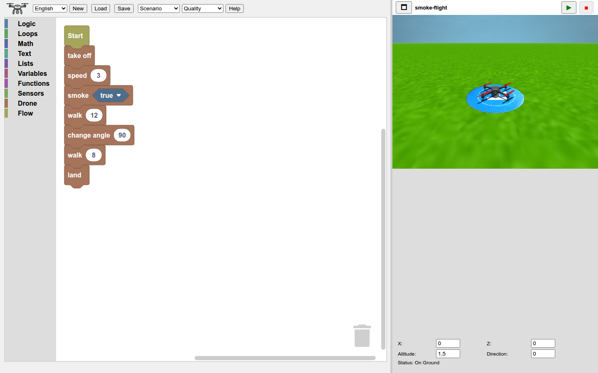

# Drone Commander


Drone Commander is an interactive browser app for programming and simulating drone flight with Blockly and Three.js. Build a flight plan with blocks, run it, and watch the drone move inside a 3D scene.

## Online Demo

Open the hosted version:

https://vroby65.github.io/DroneCommander/

## Features

- **Visual programming** with Blockly blocks for logic, loops, math, variables, functions, flow, sensors, and drone commands.
- **3D simulation** powered by Three.js, with terrain-aware altitude and landing behavior.
- **Drone commands** for take off, land, photos, video recording, set/change altitude, set/change angle, walk, walk climbing, slide, absolute/relative 3D movement, smooth curved flight, return to base, wait, smoke trail, and speed control.
- **Smooth curve handling** with coordinate-based curved flight that leaves the drone direction unchanged.
- **Sensor blocks** for keyboard input, X/Z position, altitude, direction, and speed.
- **Scenarios**: flight field, urban track, metropolis, and tropical island.
- **Graphics profiles**: Performance, Balanced, and Quality.
- **On-board drone camera** with a live picture-in-picture view from the nose of the drone. The camera follows yaw, pitch, and roll and supports timestamped PNG photo and video downloads.
- **Light and dark themes** for the full interface and Blockly workspace, with the selected theme remembered in browser local storage.
- **Scratch-style block zoom** with controls to enlarge, reduce, or reset the Blockly workspace, plus mouse-wheel and pinch zoom.
- **Program management** with New, Save, Load, autosave to browser local storage, and remembered file names.
- **Ryze/DJI Tello execution** through the companion [Drone Commander Tello Driver](https://github.com/vroby65/DroneCommander-Driver).
- **Multilingual UI and help** in English, Italian, French, German, Spanish, Portuguese, Arabic, Simplified Chinese, Korean, and Japanese.
- **Resizable layout** with a Blockly editor, 3D viewer, and status panel with live program-variable values.

## Screenshots

### Take Off And Land



### Speed And Smoke Trail



## Run Locally

Clone the repository and serve it with any static HTTP server:

```sh
git clone https://github.com/vroby65/DroneCommander.git
cd DroneCommander
python3 -m http.server 8000
```

Then open:

```text
http://127.0.0.1:8000/
```

Using an HTTP server is recommended because the app loads scenarios, textures, models, sounds, and help pages from local files.

## Usage

1. Drag a **Start** block into the Blockly workspace.
2. Attach drone blocks such as **take off**, **set altitude**, **walk**, **walk climbing**, **go to**, **move by**, **curve abs**, **curve**, **take a photo**, **start recording**, **save recording**, **return to base**, **change angle**, and **land**.
3. Click the green play button to run the program in the 3D viewer.
4. Use the panel directly below the 3D viewer to inspect or adjust X, Z, altitude, direction, and flight status. During execution it also lists every Blockly variable and its current value, one per line.
5. Enable **Camera preview** in the 3D viewer toolbar to show the on-board view in the top-left corner of the main scene. The preview remains available when the viewer is fullscreen.
6. Add a **take a photo** block to download a timestamped PNG from the on-board camera at that point in the program. This works even when the preview is hidden.
7. Place **start recording** before the actions to film, then use **save recording** to stop the camera and download the timestamped video. Recording also works with the preview hidden; stopping the program before saving cancels the active recording.
8. Select **Dark theme** at the top-right of the Blockly panel to switch the entire interface between light and dark modes.
9. Use the Blockly zoom controls to enlarge, reduce, or reset the block size. You can also zoom with the mouse wheel or a pinch gesture.
10. Use **Save** and **Load** to export or import Blockly XML programs.
11. Switch scenario or graphics profile from the toolbar when needed.

## On-board Camera

The secondary camera renders the same Three.js environment from a mounting point just beyond the drone nose. Because its position and orientation are calculated in the drone's local coordinate space, the image follows turns, climbs, dives, and banking maneuvers.

The preview is overlaid in the top-left corner of the main 3D canvas and occupies one eighth of its area, so it does not affect panel sizing or the surrounding layout. It can be shown or hidden with the **Camera preview** checkbox in the viewer toolbar, and the selected visibility is remembered in browser local storage. The preview remains visible in fullscreen mode. Its dedicated render target supplies full camera frames to the **take a photo**, **start recording**, and **save recording** blocks.

Video recording targets 30 fps at a 4:3 resolution up to 960×720. Drone Commander selects WebM (VP9 or VP8) or MP4 according to browser support. The **save recording** block terminates the recording and downloads the resulting timestamped file.

## Fly On A Real Tello

The companion [Drone Commander Tello Driver](https://github.com/vroby65/DroneCommander-Driver) is a native Go/Fyne application that loads the XML programs saved by Drone Commander and executes them on a Ryze/DJI Tello through Tello SDK 2.0.

Create and test the program in this simulator, save it as an XML file, then open it in the driver. Test it again in the driver's offline simulation mode before connecting to the drone's `TELLO-...` Wi-Fi network. For indoor flight, the driver interprets one Drone Commander unit as one centimeter and enforces the Tello movement limits documented in its README.

## Relative Movement Coordinates

The **move by** block interprets X/Y/Z relative to the drone's current direction. X moves right/left, Y moves up/down, and Z moves forward/backward. Changing the drone angle rotates the X/Z movement axes while leaving Y vertical.

## Curved Flight Notes

The **curve** and **curve abs** blocks fly through the current position, an intermediate point, and a destination point. Curves are interpolated as smooth arcs where possible and do not change the drone direction. The arc is calculated in the 3D plane defined by the three points, so circular paths can be horizontal, vertical, or tilted.

The drone banks while moving along a curve, so consecutive curve commands transition without separate pauses for tilting and straightening the drone.

For **curve abs**, both the intermediate point and destination use absolute program coordinates. For relative **curve** blocks, X/Y/Z is an offset from the current position, while XD/YD/ZD is an offset from that intermediate point. Both offsets rotate with the drone's current direction: Z is forward/backward and X is right/left.

## Project Structure

- `index.html` - Application shell, layout, and ordered script loading.
- `js/blockly.js` - Custom Blockly blocks, JavaScript generators, light/dark Blockly themes, toolbox setup, and workspace persistence.
- `js/drone-commands.js` - Three.js simulation, main and on-board cameras, command queue, flight commands, scenarios, collision handling, audio, and rendering.
- `js/ui.js` - Camera controls, theme switching, status inputs, live program-variable monitoring, program actions, layout, localization, and selectors.
- `js/app.js` - Startup sequence that initializes localization, Blockly, Three.js, and the render loop.
- `doc/` - Help pages in supported languages.
- `backgrounds/` - Scenario definitions.
- `models/` - Drone and scene models.
- `textures/` - Terrain, sky, and object textures.
- `sounds/` - Drone audio assets.
- `libs/` - Vendored Blockly and Three.js libraries.
- `screenshots/` - README screenshots generated from the current app.

## License

This project is licensed under the MIT License. See [LICENSE](LICENSE) for details.

## Contributing

Contributions are welcome. Open an issue or pull request to suggest fixes, new blocks, new scenarios, translations, or documentation improvements.
